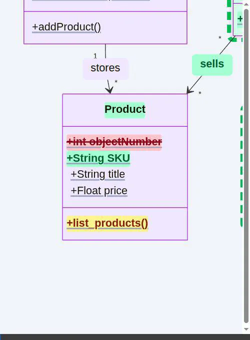
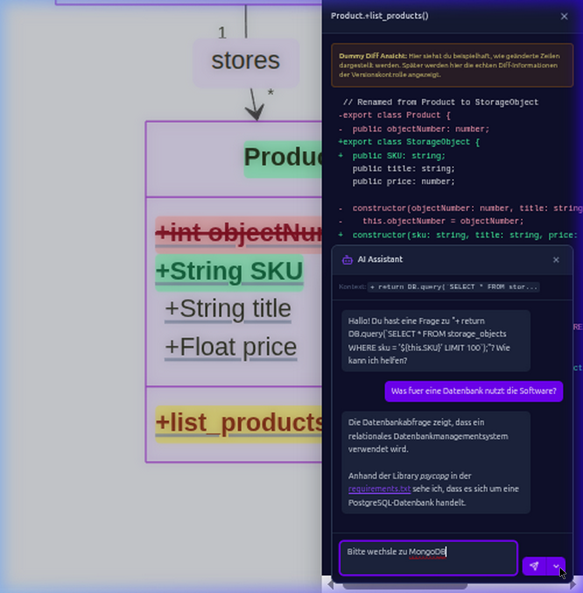
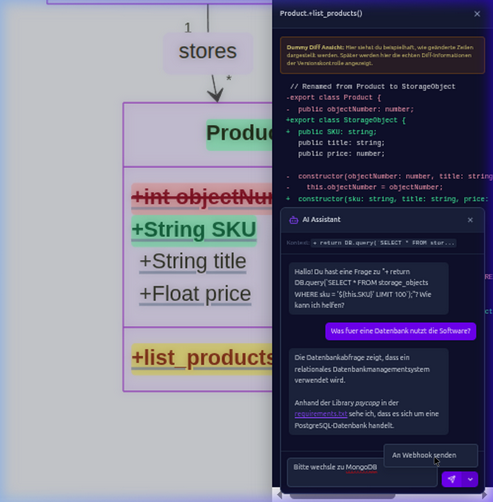

# Interactive Class Diagrams ReviewUI (Mobile-First AI Review App)

Das AI-Zeitalter hat die Softwareentwicklung grundlegend verändert. KI nimmt uns durch agentische Workflows viel Arbeit ab und produziert in kürzerer Zeit deutlich mehr Code-Output als ein einzelner Entwickler. Dadurch verschiebt sich der Fokus des Entwicklers vom bloßen Schreiben von Code hin zum architektonischen Denken. 

Die meiste Denkarbeit passiert jedoch nicht auf Knopfdruck am Schreibtisch. Die besten Ideen kommen mir oft in Alltagssituationen, etwa beim Zähneputzen. Unser Bewusstsein ist der Richtungsgeber, während das Unterbewusstsein Hintergrundprozesse verarbeitet. Wenn ich also unterwegs einen Einfall habe, muss ich KI-Agenten auch direkt von meinem Smartphone aus anstoßen und ihre Arbeit überprüfen können. Heutige Entwickler-Tools sind aber kaum für "Mobile-first" ausgelegt.

## Hintergrund

In meinen vorherigen Konzepten ([markup-class-diagram-ui-poc](https://github.com/mjairuobe/markup-class-diagram-ui-poc) und [Mobile-first-AI-Review-App-Konzept](https://github.com/mjairuobe/Mobile-first-AI-Review-App-Konzept-)) habe ich beschrieben, dass wir neue Tools brauchen, um auch große, komplexe Codebasen vom Handy aus schnell überblicken und prüfen zu können. 

Klassendiagramme (z.B. generiert durch Mermaid) eignen sich hierfür hervorragend, da sie auf einem hochformatigen Handydisplay meist ohne viel Scrollen darstellbar sind und einen sofortigen architektonischen Überblick liefern. Geänderte Funktionen oder Variablen können direkt im Diagramm hervorgehoben und interaktiv klickbar gemacht werden.

## Zielsetzung (Proof of Concept)

Dieses Proof of Concept (PoC) zielt darauf ab, einen **nahtlosen, Mobile-first Review-Prozess** über interaktive Klassendiagramme zu schaffen:

- **Automatische Generierung:** Klassendiagramme werden bei jedem Commit (z.B. aus Git-Diffs) automatisch aktualisiert.
- **Interaktive Relationen:** Mit Klicks auf Relationen (z.B. `sells` oder `pays`) lässt sich butterweich zwischen Klassen hin- und hernavigieren ("Boomerang"-Effekt).
- **Code-Einblicke:** Ein Klick auf Methoden oder Deklarationen im Diagramm öffnet einen CodeViewer im Slider, um sofort die konkrete Implementation zu betrachten.
- **KI-Unterstützung:** Direkt im CodeViewer kann über ein Kontextmenü ("Ask / Comment") ein KI-Chat gestartet werden, um Rückfragen zum Quellcode zu stellen oder Aufgaben per Webhook an Agenten zu delegieren.

### Visuelle Legende für Codeänderungen im Diagramm

Um Modifikationen im Diagramm schnell erfassen zu können, nutzen wir eine einfache Farblogik:

*   🟨 Gelb: Der Code in dieser Methode/Klasse wurde **geändert**.
*   🟩 Grün: Dieser Code ist komplett **neu hinzugekommen**.
*   🟥 Rot: Dieser Code wurde **entfernt**.

*(Anmerkung: In diesem PoC wurden die Dummy-Diffs noch nicht farblich im Diagramm abgebildet, das ist Teil der Ausbaustufe!)*

## Demo & Impressionen

### Nahtlose Navigation zwischen Klassen (Boomerang-Effekt)
Ein Klick auf eine Relation wie `sells` animiert fließend zur Ziel-Klasse, ein erneuter Klick bringt uns wieder zurück.

### Nahtloses Einblenden von Quellcode
Ein Klick auf die Methode `list_products()` schiebt den responsiven CodeViewer direkt ins Sichtfeld, ohne den Kontext zu verlieren.

### KI-Assistent & Chat-Interface
Direkt am Code kann durch Markieren ein Chat-Fenster geöffnet werden. Die KI antwortet auf Anfragen zum Code oder der Datenbank.

### Agentische Aktionen via Webhook
Aus dem Chat heraus lassen sich Aktionen über ein Dropdown-Menü direkt an externe Systeme delegieren (z.B. Webhooks).

## Ausblick

Das PoC beweist: Code-Reviews und Architektur-Verständnis lassen sich sehr wohl auf Smartphones portieren. Die nächsten Schritte wären:
1.  **Dynamische Backend-Anbindung:** Ersetzen der Dummy-Diffs durch echte Git-Integration (automatische Generierung der Mermaid-Graphen).
2.  **Farbliches Diff-Highlighting im Diagramm:** Die oben genannte Farblegende als CSS-Styles auf die SVG-Elemente anwenden.
3.  **Template-System für Responses:** Längenbegrenzungen und klare Vorlagen für KI-Antworten, damit Reviews noch schneller konsumierbar sind (z.B. für Bugfix-Reports oder PR-Summaries).
